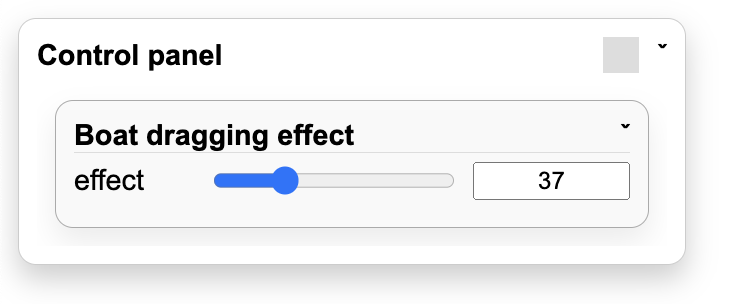

# Control Panel

## Componente range



### English:

This example shows how to change the operation of a range component, inverting the numeric values shown in the input 
range and number

### Português:

Este exemplo mostra como alterar o funcionamento de um componente do tipo range, invertendo os valores numéricos 
mostrados no input range e number

### Makefile

```shell
make help         ## This help command
make buildandrun  ## build this example and run local server
make build        ## build main.wasm file to run this example
make server       ## run local server
```

### Local server

[https://localhost/examples/controlPanelRangeComplex/](https://localhost/examples/controlPanelRangeComplex/)

### Code:

##### Golang

```go
package main

import (
	"github.com/helmutkemper/iotmaker.webassembly/browser/factoryBrowser"
	"github.com/helmutkemper/iotmaker.webassembly/browser/html"
	"github.com/helmutkemper/iotmaker.webassembly/platform/algorithm"
	"github.com/helmutkemper/iotmaker.webassembly/platform/components"
	"github.com/helmutkemper/iotmaker.webassembly/platform/factoryAlgorithm"
	"github.com/helmutkemper/iotmaker.webassembly/platform/factoryColor"
	"github.com/helmutkemper/iotmaker.webassembly/platform/factoryEasingTween"
	"math"
	"time"
)

// Control Panel Example
//
// The range component contains two main HTML elements, one of type number, and the other of type range. When one
// changes, the other changes along with it, with the same value.
//
// This example shows how to change the behavior of a Range component to invert the values shown in the html input
// number and html input range components.

// ComponentControlPanel Create a component
type ComponentControlPanel struct {

	// Embeds component control
	components.Components

	// Panel Create a control panel
	Panel *ControlPanel `wasmPanel:"type:panel"`
}

func (e *ComponentControlPanel) Init() (panel *html.TagDiv, err error) {
	panel, err = e.Components.Init(e)
	return
}

// ControlPanel Defines the control panel body
type ControlPanel struct {

	// Header Sets title text, default:Control panel
	Header string `wasmPanel:"type:headerText;label:Control panel"`

	// Body Prepare the control panel body, one container per field
	Body *Body `wasmPanel:"type:panelBody"`
}

type Body struct {

	// BoatEffect Create the container named 'label:Boat dragging effect'
	BoatEffect *BoatAdjust `wasmPanel:"type:component;label:Boat dragging effect"`
}

// BoatAdjust Define the container named 'label:Boat dragging effect'
type BoatAdjust struct {

	// Dragging Creates a component of type range
	Dragging *DraggingEffect `wasmPanel:"type:range;label:effect"`
}

// DraggingEffect Defines the behavior of the components.Range component
type DraggingEffect struct {
	// Embeds the components.Range control
	components.Range

	// TagRange is an optional way to have a component reference `wasmPanel:"type:inputTagRange"`
	TagRange *html.TagInputRange `wasmPanel:"type:inputTagRange"`

	// TagNumber is an optional way to have a component reference `wasmPanel:"type:inputTagNumber"`
	TagNumber *html.TagInputNumber `wasmPanel:"type:inputTagNumber"`

	// Color can be float64 or int64 and defines the behavior of the component
	Color float64 `wasmPanel:"type:value;min:2;max:50;step:1;default:15"`

	// ColorChange Creates a listener for the `event:change`, using the `func:OnChange` function defined in the `OnChangeEvent` struct
	ColorChange *OnChangeEvent `wasmPanel:"type:listener;event:change;func:OnChange"`

	// RangeChange Obscures the `event:input` used by the component to function correctly, using the `func:OnInput` function defined in the `OnChangeEvent` struct
	RangeChange *OnChangeEvent `wasmPanel:"type:listener;event:input;func:OnInput"`
}

// MathematicalFormula Defines a mathematical formula to invert the operation of the input number with the component's input range
func (e *DraggingEffect) MathematicalFormula(min, max, value float64) (result float64) {
	return (max - value) + min
}

// Init Defines the function called when the component is initialized. Remember that Init function inside struct is standard in go.
func (e *DraggingEffect) Init() {
	// This initialization changes the expected behavior of the component
	e.TagNumber.Value(e.MathematicalFormula(2, 50, e.TagRange.GetValue()))
	e.TagRange.Value(e.MathematicalFormula(2, 50, e.TagNumber.GetValue()))
}

// OnChangeEvent Defines the data to be captured when a listener even happens
type OnChangeEvent struct {

	// IsTrusted `wasmGet:"isTrusted"` indicates when the event is generated by a human user or a testing framework
	IsTrusted bool `wasmGet:"isTrusted"`

	// Type `wasmGet:"type"` is a property of the html component input
	Type string `wasmGet:"type"`

	// Value `wasmGet:"value"` is a property of the html component input
	Value float64 `wasmGet:"value"`

	// Min `wasmGet:"min"` is a property of some html components of type input
	Min float64 `wasmGet:"min"`

	// Max `wasmGet:"max"` is a property of some html components of type input
	Max float64 `wasmGet:"max"`
}

// OnChange is the function called for the listener, defined in `ColorChange *OnChangeEvent` and its name was defined in `func:OnChange`
//
//   event: is the populated object
//   reference: is the parent object with the component references
func (e *OnChangeEvent) OnChange(_ OnChangeEvent, reference DraggingEffect) {
	// As the standard functioning of the component was changed, I preferred to get the value of the html number component within the component
	var value = reference.TagNumber.GetValue()

	// start the easing tween function
	factoryEasingTween.NewInOutSine(
		time.Duration(value)*time.Second,
		0,
		10000,
		tagDivRocket.EasingTweenWalkingAndRotateIntoPoints,
		0,
	).
		SetArgumentsFunc(any(tagDivRocket)).
		SetDoNotReverseMotion()
}

// OnInput  is the function called for the listener, defined in `RangeChange *OnChangeEvent` and its name was defined in `func:OnInput`
func (e *OnChangeEvent) OnInput(event OnChangeEvent, reference DraggingEffect) {
	// Defines which component generated the event and changes the opposite component
	switch event.Type {
	case "range":
		reference.TagNumber.Value(reference.MathematicalFormula(event.Min, event.Max, reference.TagRange.GetValue()))
	case "number":
		reference.TagRange.Value(reference.MathematicalFormula(event.Min, event.Max, reference.TagNumber.GetValue()))
	}
}

var canvas *html.TagCanvas
var tagDivRocket *html.TagDiv

func main() {
	var err error
	var panel *html.TagDiv

	stage := factoryBrowser.NewStage()

	controlPanel := ComponentControlPanel{}
	if panel, err = controlPanel.Init(); err != nil {
		panic(err)
	}

	canvas = factoryBrowser.NewTagCanvas(stage.GetWidth(), stage.GetHeight())
	stage.Append(canvas)

	border := 50.0
	wight := 400.0
	height := 400.0

	var bezier = BezierCurve(border, wight, height)

	tagDivRocket = factoryBrowser.NewTagDiv().
		Class("animate").
		AddPointsToEasingTween(bezier).
		SetDeltaX(-25).
		SetDeltaY(-25).
		RotateDelta(-math.Pi).
		SetXY(int(1*wight+border), int(0*height+border)).
		Html("")
	stage.Append(tagDivRocket)

	stage.Append(panel)

	done := make(chan struct{})
	done <- struct{}{}

}

func BezierCurve(border, wight, height float64) (bezier *algorithm.BezierCurve) {
	bezier = factoryAlgorithm.NewBezierCurve()

	// E.g.: P0 (1,0) = (1*wight,0*height)
	// E.g.: P1 (2,0) = (2*wight,0*height)
	// E.g.: P2 (2,1) = (2*wight,1*height)
	//
	//     (0,0)            (1,0)            (2,0)
	//       +----------------+----------------+
	//       | P7            P0             P1 |
	//       |                                 |
	//       |                                 |
	//       |                                 |
	// (0,1) + P6                           P2 + (2,1)
	//       |                                 |
	//       |                                 |
	//       |                                 |
	//       | P5            P4             P3 |
	//       +----------------+----------------+
	//     (0,2)            (1,2)            (2,2)

	bezier.Add(algorithm.Point{X: 1*wight + border, Y: 0*height + border})
	bezier.Add(algorithm.Point{X: 2*wight + border, Y: 0*height + border})
	bezier.Add(algorithm.Point{X: 2*wight + border, Y: 1*height + border})
	bezier.Add(algorithm.Point{X: 2*wight + border, Y: 2*height + border})
	bezier.Add(algorithm.Point{X: 1*wight + border, Y: 2*height + border})
	bezier.Add(algorithm.Point{X: 0*wight + border, Y: 2*height + border})
	bezier.Add(algorithm.Point{X: 0*wight + border, Y: 1*height + border})
	bezier.Add(algorithm.Point{X: 0*wight + border, Y: 0*height + border})
	bezier.Add(algorithm.Point{X: 1*wight + border, Y: 0*height + border})
	bezier.Process()
	for _, point := range *bezier.GetProcessed() {
		AddDotBlue(int(point.X), int(point.Y))
	}

	return
}

func AddDotBlue(x, y int) {
	canvas.BeginPath().
		FillStyle(factoryColor.NewBlueHalfTransparent()).
		Arc(x, y, 0.5, 0, 2*math.Pi, false).
		Fill()
}
```
